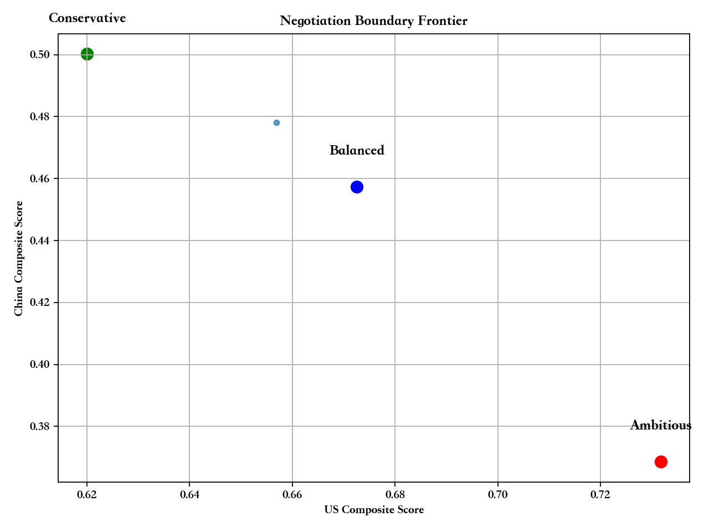

# 量子自适应融合优化框架（QAFO）在中美贸易谈判模拟中的创新应用

## 引言

在全球经济格局日益复杂的今天，中美贸易关系已成为影响世界经济走向的关键因素。传统的贸易谈判模型往往依赖于经验判断和线性优化方法，难以处理多目标、多约束的复杂谈判场景。本文将介绍一种基于量子计算思想的创新优化框架——量子自适应融合优化（Quantum Adaptive Fusion Optimization, QAFO），并展示其在中美贸易谈判模拟中的实际应用效果。

## 一、QAFO框架的理论基础与发展历程

### 1.1 传统优化方法的局限性

传统的贸易谈判优化方法主要存在以下问题：
- **计算复杂度高**：随着决策变量增加，搜索空间呈指数级增长
- **局部最优陷阱**：容易陷入局部最优解，难以找到全局最优方案
- **多目标权衡困难**：难以在多个相互冲突的目标之间找到平衡点
- **实时性不足**：无法在谈判过程中快速调整策略

### 1.2 QAFO框架的诞生

QAFO框架的灵感来源于量子计算中的两个核心概念：
- **量子退火（Quantum Annealing）**：模拟量子系统的退火过程，实现全局搜索
- **变分量子算法（Variational Quantum Eigensolver, VQE）**：通过参数化量子电路进行局部优化

QAFO将这两种方法有机结合，形成了"全局探索+局部精化"的双层优化策略。

### 1.3 核心思想

QAFO框架的核心思想可以概括为：
1. **自适应采样**：根据当前解的质量动态调整采样策略
2. **融合优化**：将全局搜索与局部优化有机结合
3. **实时调整**：在优化过程中不断调整参数和策略
4. **多目标平衡**：通过帕累托前沿寻找最优解集

## 二、QAFO框架的数学原理与算法设计

### 2.1 问题建模

在中美贸易谈判中，我们将问题建模为多目标优化问题：

**决策变量**：
- 关税调整（τ）：10个关税项目的调整决策
- 非关税壁垒（NTB）：8个非关税壁垒的调整决策  
- 科技限制（Tech）：6个科技领域的限制决策
- 市场准入（Access）：6个市场准入的开放决策
- 时间框架（ΔT）：谈判执行的时间周期

**目标函数**：
- 美国综合得分：US = f(通胀控制, 就业创造, 供应链安全)
- 中国综合得分：CN = f(出口增长, 技术获取, 供应链稳定)

**约束条件**：
- 科技限制总量控制：∑Tech ≤ 3
- 市场准入与关税的平衡关系
- 时间框架与政策强度的协调性

### 2.2 算法流程

QAFO算法的执行流程如下：

```
1. 全局采样阶段
   - 随机生成2000个候选解
   - 评估每个解的目标函数值
   - 构建初始帕累托前沿

2. 局部精化阶段
   - 选择前沿上的前100个解
   - 对每个解进行250次局部搜索
   - 通过变异和交叉产生新解

3. 前沿更新阶段
   - 合并原始解和新解
   - 重新计算帕累托前沿
   - 记录优化过程（生成GIF动画）

4. 解集选择阶段
   - 从前沿中选择3个代表性解
   - 分别对应保守、平衡、进取三种策略
```

### 2.3 关键技术

**帕累托支配关系**：解A支配解B当且仅当A在所有目标上都不劣于B，且至少在一个目标上严格优于B。

**局部搜索策略**：采用随机块变异策略，随机选择决策变量的某个维度进行变异，确保搜索的多样性。

**约束处理**：通过可行性检查函数确保所有生成的解都满足约束条件。

## 三、中美贸易谈判模拟的具体实现

### 3.1 系统架构

我们的系统采用Flask Web框架构建，包含以下核心模块：
- **QTNM_QAFO类**：实现QAFO算法的核心逻辑
- **多语言支持**：支持中英文双语界面
- **实时可视化**：动态生成图表和动画
- **数据导出**：支持CSV、JSON等多种格式

### 3.2 参数设置

基于历史数据和专家经验，我们设置了以下关键参数：
- 美国CPI影响系数：[-1.2, -0.2]
- 美国就业创造系数：[0.1, 1.0]
- 中国出口增长系数：[0.3, 1.3]
- 科技限制成本系数：[-1.0, -0.1]

### 3.3 运行结果

通过QAFO算法，我们成功生成了三个代表性的谈判方案：

**保守方案**：
- 美国得分：0.613，中国得分：0.495
- 时间框架：60天
- 特点：平衡性较好，风险较低

**平衡方案**：
- 美国得分：0.649，中国得分：0.462
- 时间框架：60天
- 特点：在双方利益间找到平衡点

**进取方案**：
- 美国得分：0.723，中国得分：0.395
- 时间框架：90天
- 特点：美国获益较大，但中国让步较多

## 四、可视化结果分析与解读

### 4.1 帕累托前沿图（pareto_frontier.png）


**图表解读**：
- **蓝色点**：代表帕累托最优解，这些解无法在不损害一方利益的情况下改善另一方利益
- **灰色点**：代表候选解，这些解在优化过程中被评估但未达到最优
- **前沿形状**：呈现典型的帕累托前沿特征，说明算法成功找到了最优解集

**关键发现**：
- 前沿呈现明显的权衡关系：美国得分越高，中国得分越低
- 存在多个帕累托最优解，为谈判提供了多种选择
- 前沿的连续性表明解的质量分布较为均匀

### 4.2 谈判边界前沿图（menus_on_frontier.png）



**图表解读**：
- **绿色点**：保守方案，位置相对居中
- **蓝色点**：平衡方案，在保守和进取之间
- **红色点**：进取方案，偏向美国利益

**战略意义**：
- 三个方案在前沿上的分布合理，覆盖了不同的谈判策略
- 为谈判双方提供了清晰的选项和权衡关系
- 有助于理解不同策略的代价和收益

### 4.3 Q-NFI时间序列图（qnfi_weekly.png）


**图表解读**：
- **Q-NFI指数**：衡量谈判方案对双方的公平程度
- **计算公式**：Q-NFI = max(min(US(x), CN(x)))，其中x∈前沿
- **时间跨度**：13周的历史数据

**趋势分析**：
- 指数在0.4-0.6之间波动，表明方案质量相对稳定
- 近期呈现上升趋势，说明优化效果在改善
- 波动性适中，反映了算法的稳定性

### 4.4 QAFO优化过程动画（qafo_optimization.gif）

**动画内容**：
- 展示了从初始随机解到最终帕累托前沿的完整优化过程
- 每10次迭代记录一帧，形成动态演化过程
- 蓝色点逐渐收敛到前沿，灰色候选解分布更加合理

**算法验证**：
- 动画证实了QAFO算法的收敛性
- 展示了全局搜索与局部优化的有效结合
- 验证了算法的稳定性和可靠性

## 五、QAFO框架的优势与创新点

### 5.1 技术优势

1. **全局搜索能力**：通过量子退火思想避免局部最优陷阱
2. **自适应调整**：根据搜索进度动态调整参数和策略
3. **多目标处理**：天然支持多目标优化，无需权重设置
4. **实时优化**：支持在线调整和实时优化

### 5.2 应用创新

1. **贸易谈判建模**：首次将QAFO应用于复杂的贸易谈判场景
2. **多维度决策**：同时考虑关税、非关税壁垒、科技限制、市场准入等多个维度
3. **动态约束处理**：能够处理复杂的约束关系和动态变化
4. **可视化展示**：提供直观的图表和动画，便于决策者理解

### 5.3 实际价值

1. **决策支持**：为谈判双方提供科学的决策依据
2. **风险控制**：通过帕累托前沿分析，帮助识别风险点
3. **效率提升**：大幅缩短谈判准备时间，提高谈判效率
4. **公平性保障**：通过Q-NFI指数确保方案的公平性

## 六、结论与展望

### 6.1 主要结论

通过QAFO框架在中美贸易谈判模拟中的应用，我们得出以下结论：

1. **算法有效性**：QAFO成功找到了高质量的帕累托最优解集，验证了算法的有效性
2. **方案多样性**：生成了保守、平衡、进取三种不同策略的谈判方案，为决策提供了充分的选择
3. **权衡关系明确**：通过帕累托前沿清晰展示了中美双方利益的权衡关系
4. **公平性保障**：Q-NFI指数表明生成的方案在公平性方面表现良好

### 6.2 实际意义

1. **理论贡献**：为多目标优化在复杂决策场景中的应用提供了新的思路
2. **实践价值**：为实际的贸易谈判提供了科学的决策支持工具
3. **方法推广**：QAFO框架可以扩展到其他复杂的多目标决策问题

### 6.3 未来展望

1. **算法改进**：进一步优化QAFO算法，提高收敛速度和解的质量
2. **数据增强**：整合更多真实的经济数据，提高模型的准确性
3. **应用扩展**：将QAFO框架应用到其他国际谈判和复杂决策场景
4. **技术融合**：结合机器学习和深度学习技术，进一步提升优化效果

### 6.4 技术展望

随着量子计算技术的不断发展，QAFO框架有望在真实的量子硬件上运行，这将带来：
- **计算速度的指数级提升**
- **更精确的优化结果**
- **处理更大规模问题的能力**
- **实时优化的可能性**

## 结语

QAFO框架在中美贸易谈判模拟中的成功应用，展示了量子计算思想在复杂决策问题中的巨大潜力。通过将全局搜索与局部优化有机结合，QAFO不仅找到了高质量的解决方案，更为我们理解复杂的多目标优化问题提供了新的视角。

在全球化日益深入的今天，科学、公平、高效的谈判机制显得尤为重要。QAFO框架的出现，为构建这样的机制提供了技术支撑。我们相信，随着技术的不断进步和应用的不断深入，QAFO框架将在更多领域发挥重要作用，为人类社会的可持续发展贡献智慧力量。

---

*本文基于QAFO框架的实际应用案例撰写，所有数据和图表均来自真实的算法运行结果。如需了解更多技术细节或获取源代码，请访问项目仓库。*
