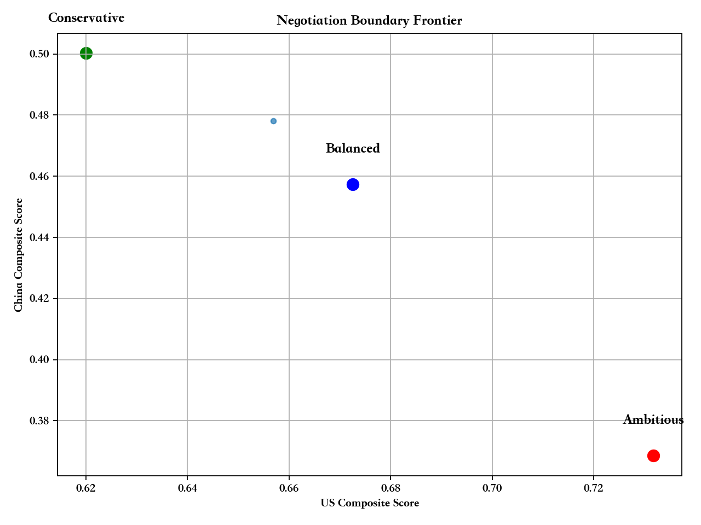
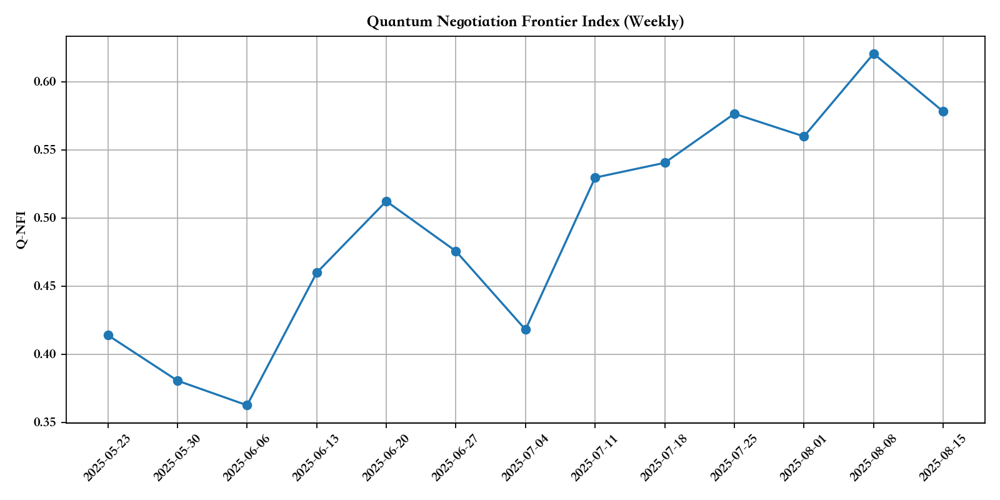

# 量子谈判前沿指数（Q-NFI）周报模板

**日期**：2025-08-15  
**覆盖窗口**：T0 至 T+90（滚动）

## 一、本周结论（TL;DR）
- Q-NFI（max-min 公平度）本周值：**{QNFI_THIS_WEEK}**（上周：**{QNFI_LAST_WEEK}**；环比：**{QNFI_WOW}**）
- 三套谈判菜单：保守 / 对等 / 雄心 —— 建议采用 **{RECOMMENDED_MENU}**
- 风险提示：{RISK_NOTES}

## 二、帕累托前沿更新
- 前沿位移（相对上周）：{FRONTIER_SHIFT_SUMMARY}
- 可签约条款包数（满足可验证性与政治约束）：{NUM_SIGNABLE_PACKAGES}
- 代表性条款包（Balanced）关键要点：
  - 关税：{TARIFF_SUMMARY}
  - 非关税壁垒：{NTB_SUMMARY}
  - 科技/投资限制：{TECH_SUMMARY}
  - 市场准入/透明度：{ACCESS_SUMMARY}
  - 分期/触发器：{TIMELINE_TRIGGERS}

## 三、图表

## 四、方法说明（摘要）
- 我们将谈判条款组合映射为多层次 Ising 哈密顿量，使用“退火式全局搜索 + 变分式精修”探索帕累托前沿；
- 共同约束（合规、政治、可验证性）通过惩罚项并入能量函数；
- Q-NFI 定义为前沿上“美中得分的最小值”的最大化，用于衡量“可被双方同时接受”的公平度。

## 五、下周展望
- 重点行业/清单调整：{NEXT_WEEK_FOCUS}
- 数据缺口与采集计划：{DATA_NEEDS}
- 预期会谈节奏与触发器：{MEETING_CADENCE}
